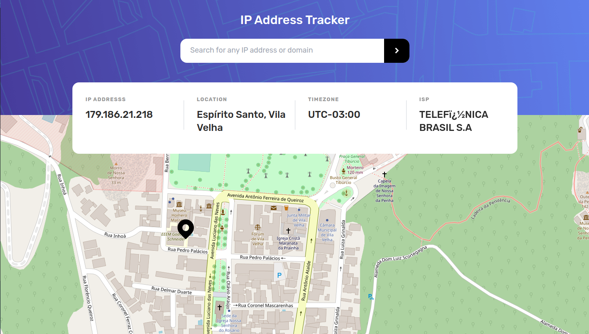
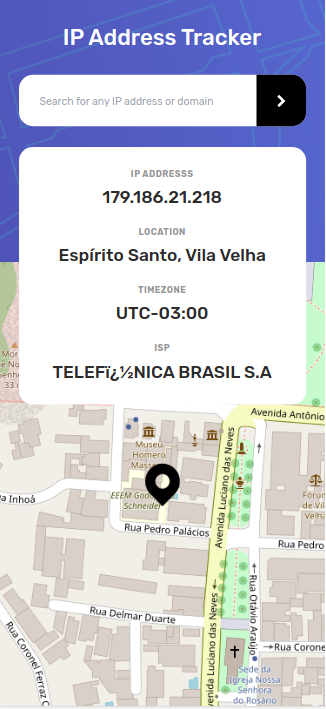

# Frontend Mentor - IP address tracker solution

This is a solution to the [IP address tracker challenge on Frontend Mentor](https://www.frontendmentor.io/challenges/ip-address-tracker-I8-0yYAH0).

## Table of contents

- [Overview](#overview)
  - [The challenge](#the-challenge)
  - [Screenshot](#screenshot)
  - [Links](#links)
- [My process](#my-process)
  - [Built with](#built-with)
  - [What I learned](#what-i-learned)
  - [Useful resources](#useful-resources)
- [Author](#author)

## Overview

### The challenge

Users should be able to:

- View the optimal layout for each page depending on their device's screen size
- See hover states for all interactive elements on the page
- See their own IP address on the map on the initial page load
- Search for any IP addresses or domains and see the key information and location

Personal Challenge:

- Use redux

### Screenshot

### Links

- Solution URL: [Add solution URL here](https://your-solution-url.com)
- Live Site URL: [Add live site URL here](https://your-live-site-url.com)

## My process

### Built with

- Semantic HTML5 markup
- CSS custom properties
- Flexbox
- Mobile-first workflow
- [React](https://reactjs.org/) - JS library
- [Redux](https://redux.js.org/) - React framework
- [Styled Components](https://styled-components.com/) - For styles
- [Tailwind](https://tailwindcss.com/docs/padding) - For styles
- [MUI](https://mui.com/) - Mounted components

### What I learned

- How to use the leaflet library
- How to use Redux with async logic
- How to use the Styled Component library
- How to protect your API key

### Useful resources

- [Example resource 1](https://www.example.com) - This helped me for XYZ reason. I really liked this pattern and will use it going forward.
- [Example resource 2](https://www.example.com) - This is an amazing article which helped me finally understand XYZ. I'd recommend it to anyone still learning this concept.

## Author

- Linkedin- [Gabriel Pinheiro](https://www.linkedin.com/feed/)
- Frontend Mentor - [@GabrielFMPinheiro](https://www.frontendmentor.io/profile/GabrielFMPinheiro)
- Codewars - [@GabrielFMPinheiro](https://www.codewars.com/users/GabrielFMPinheiro)
